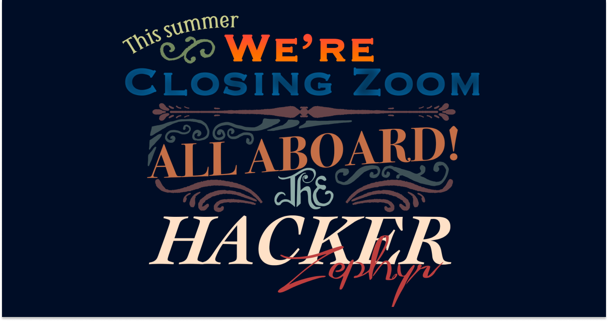

# Hacker Zephyr Site

_Created using Theme UI & Next.js. Based on [Hack Club Theme Starter](https://github.com/hackclub/theme-starter)._

## Usage

1. Import this repo to your coding environment of choice. Download it, `git clone`, or use the GitHub import on Glitch/Repl.it.
2. `yarn` to install dependencies.
3. `yarn dev` to start your server.
4. Start adding your own pages & components in their respective directories.

## TODO

- [ ] ~~Animation should be higher quality~~
- [x] Hack club Dino flag should be top left (sam)
- [ ] ~~Trans-America * Burlington, Vermont — Los Angeles, California~~
- [x] Telegram dotted line doesn't feel like paper
- [x] I want the seal to be bigger @msw
- [x] Mobile- seal has a visual bug (iPhone) @msw
- [x] Telegraph should be bigger font (@zfogg)
- [x] Telegraph could be wider (@zfogg)
- [ ] ~~Signatures could be same font weight~~
- [x] Signature should have name & slack handle
- [x] Apply now should look more like a ticket— full page CTA (TBD zfogg)
- [x] Oh the places you'll go above CTA
- [x] "A project by hack club" -> "a gift from hackclub"
- [x] Appendix should be more legible & not feel too small
- [x] Add Claire signature

---

- [X] Need bulletpoint & comma in header
- [x] Background color is off on landing
- [x] Telegram black is too dark
- [x] Drop the dotted lines on telegram
- [x] Orpheus flag top -> side
- [x] Nbs on telegram “the hacker zephyr”
- [ ] “Hacker Zephyr” on gallery
- [ ] Less stock photos in gallery
- [ ] Venice beach photo -> Pacific Ocean
- [ ] The “hacker zephyr” superdome
	- [ ] Link to site
- [ ] Gallery should be more explorable
- [ ] Gallery can have more text at the bottom
- [x] Apply now -> register your interest
- [ ] Registration timetable after apply
- [X] “A gift from hack club HQ”
- [X] 15-25 (update dates)
